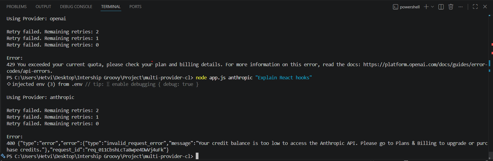
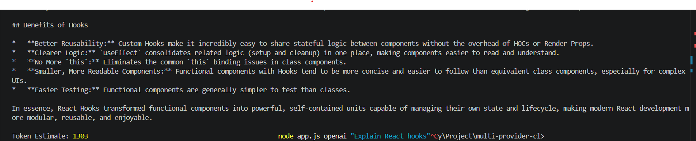

# 🚀 Multi-Provider CLI Bot — Day 9

A **production-grade AI command-line chatbot** built with Node.js, supporting three AI providers with streaming, retry logic, prompt caching, telemetry logging, a usage dashboard, and a codebase explainer.

---

## 📌 Features

| Feature | Status |
|---|---|
| Gemini 2.5 Flash integration | ✅ |
| OpenAI GPT-4o-mini integration | ✅ |
| Anthropic Claude 3 Haiku integration | ✅ |
| Streaming responses to terminal | ✅ |
| Retry handling with exponential backoff | ✅ |
| **Anthropic Prompt Caching** (90 % cost saving) | ✅ NEW |
| **Telemetry logging** → `logs/usage.csv` | ✅ NEW |
| **Token usage dashboard** (`dashboard.js`) | ✅ NEW |
| **Codebase explainer** (`explain.js`) | ✅ NEW |
| Real token counts from provider APIs | ✅ NEW |
| Estimated USD cost per query | ✅ NEW |
| Cache hit/miss statistics | ✅ NEW |
| Secure `.env` API key management | ✅ |
| Production-grade error handling | ✅ |

---

## 🛠️ Tech Stack

- **Runtime**: Node.js (CommonJS)
- **Language**: JavaScript
- **`dotenv`** — environment variable management
- **`openai`** SDK — GPT-4o-mini streaming + usage metadata
- **`@google/genai`** SDK — Gemini 2.5 Flash streaming + `usageMetadata`
- **`@anthropic-ai/sdk`** — Claude 3 Haiku with prompt caching + streaming
- **`p-retry`** — retry logic with exponential backoff
- **Node.js `fs`** — telemetry CSV writing (zero extra dependencies)

---

## 📋 Prerequisites

- Node.js v18 or later
- npm
- Gemini API Key → [aistudio.google.com/app/apikey](https://aistudio.google.com/app/apikey)
- OpenAI API Key → [platform.openai.com/api-keys](https://platform.openai.com/api-keys)
- Anthropic API Key → [console.anthropic.com/settings/keys](https://console.anthropic.com/settings/keys)

```bash
node --version   # must be v18+
npm --version
```

---

## 📂 Project Structure

```
multi-provider-cli/
│
├── app.js               # CLI entry point — routes prompts to providers
├── dashboard.js         # Token usage dashboard — reads logs/usage.csv
├── explain.js           # Codebase explainer — powered by Gemini
├── package.json
├── .env                 # API keys (never committed)
├── .gitignore
├── README.md
│
├── providers/
│   ├── anthropic.js     # Claude 3 Haiku + prompt caching
│   ├── gemini.js        # Gemini 2.5 Flash + usageMetadata
│   └── openai.js        # GPT-4o-mini + stream_options usage
│
├── utils/
│   ├── cacheStats.js    # Anthropic cache hit/miss tracker
│   ├── logger.js        # CSV telemetry writer
│   ├── retry.js         # Exponential backoff retry loop
│   └── tokenCounter.js  # Word-count token estimator
│
└── logs/
    └── usage.csv        # Auto-generated on first run
```

---

## ⚙️ Installation

```bash
# 1. Clone
git clone https://github.com/Hetvi2211/multi-provider-cli.git
cd multi-provider-cli

# 2. Install dependencies
npm install

# 3. Create .env
OPENAI_API_KEY=your_openai_api_key
ANTHROPIC_API_KEY=your_anthropic_api_key
GEMINI_API_KEY=your_gemini_api_key
```

---

## ▶️ Running the Chat CLI

```bash
node app.js gemini    "Explain React hooks"
node app.js openai    "Explain React hooks"
node app.js anthropic "Explain React hooks"
```

**Example output:**

```
Using Provider: gemini

React hooks are functions that let you use state and other React features
in functional components...

Token Estimate (word count): 42

📊 Telemetry logged → logs/usage.csv
   Tokens  : 10 in / 42 out / 52 total
   Est. cost: $0.000013
```

---

## 🧠 Anthropic Prompt Caching

Prompt caching is enabled on the Anthropic provider using the `cache_control` API directive.

### How It Works

1. The **system prompt** is sent as a content block marked with `cache_control: { type: "ephemeral" }`.
2. **First call** — Anthropic writes the system prompt to its KV cache → `cache_creation_input_tokens` appears in `usage`.
3. **Subsequent calls** (within 5 minutes) — system prompt is served from cache → `cache_read_input_tokens` appears in `usage`.
4. Cache-read tokens cost only **10 %** of the normal input price → **90 % saving**.

### Cost Breakdown

| Token Type | Price per 1M tokens | When |
|---|---|---|
| Normal input | $0.25 | Uncached prompt tokens |
| Cache **WRITE** | $0.3125 (1.25×) | First call — populating cache |
| Cache **READ** | $0.025 (0.10×) | Subsequent calls — 90 % saving |
| Output | $1.25 | Always |

### Usage — See a Cache Hit

Run the `anthropic` provider **twice** within 5 minutes:

```bash
node app.js anthropic "Explain async/await"   # Call 1 → CACHE WRITE
node app.js anthropic "What is a closure?"    # Call 2 → CACHE HIT ✅
```

### Example Terminal Output

**First call — Cache WRITE:**

```
┌─────────────────────────────────────────┐
│        🧠 Anthropic Cache Statistics      │
└─────────────────────────────────────────┘

  📥 Cache STATUS   : CACHE WRITE (first call)
     Tokens written : 1134
     Cost note      : Charged at 1.25× normal input price
                      (one-time cost to populate the cache)

  📨 Input tokens   : 12  (uncached, full price)
  📤 Output tokens  : 87
```

**Second call — Cache HIT:**

```
┌─────────────────────────────────────────┐
│        🧠 Anthropic Cache Statistics      │
└─────────────────────────────────────────┘

  ⚡ Cache STATUS   : CACHE HIT  ✅
     Tokens read    : 1134
     Cost note      : Charged at 0.10× normal price
                      → 90 % saving on cached tokens

  💰 Estimated saving: $0.000255  (1134 tokens at 90 % discount)
```

---

## 📊 Telemetry Logging

Every successful API response is **automatically appended** to `logs/usage.csv`.  
The `logs/` directory and CSV header are created on the first run — no setup needed.

### CSV Format

```
timestamp,provider,model,input_tokens,output_tokens,total_tokens,cache_creation_tokens,cache_read_tokens,estimated_cost
2026-06-09T15:22:38.291Z,gemini,gemini-2.5-flash,10,33,43,0,0,0.000011
2026-06-10T04:06:04.409Z,gemini,gemini-2.5-flash,2,9,11,0,0,0.000003
2026-06-10T04:23:15.100Z,anthropic,claude-3-haiku-20240307,12,87,1233,1134,0,0.000464
2026-06-10T04:23:41.882Z,anthropic,claude-3-haiku-20240307,12,91,1237,0,1134,0.000147
```

### Column Reference

| Column | Description |
|---|---|
| `timestamp` | ISO-8601 UTC timestamp |
| `provider` | `gemini` / `openai` / `anthropic` |
| `model` | Exact model name from provider |
| `input_tokens` | Uncached input tokens (full price) |
| `output_tokens` | Completion tokens |
| `total_tokens` | Sum of all token types |
| `cache_creation_tokens` | Tokens written to cache (1.25× price) |
| `cache_read_tokens` | Tokens read from cache (0.10× price) |
| `estimated_cost` | USD cost to 6 decimal places |

### Notes

- `logs/` is created automatically — no manual setup needed
- Each row is appended; existing rows are never overwritten
- `logs/usage.csv` is in `.gitignore` — your data stays private
- Telemetry failure never crashes the main application

---

## 📈 Usage Dashboard

The dashboard reads `logs/usage.csv` and prints a formatted summary grouped by provider.

### Usage

```bash
node dashboard.js
# or
npm run dashboard
```

### Example Output

```
╔═════════════════════════════════════════════════╗
║            📊  TOKEN USAGE DASHBOARD            ║
╚═════════════════════════════════════════════════╝

  Data range :    9/6/2026, 8:52:38 pm
            →   10/6/2026, 9:36:04 am

┌─────────────────────────────────────────────────┐
│                 OVERALL SUMMARY                 │
├─────────────────────────────────────────────────┤
│  Total Requests      :                        15 │
│  Total Input Tokens  :                     1,500 │
│  Total Output Tokens :                     2,200 │
│  Total Tokens        :                     3,700 │
│  Total Estimated Cost:                  $0.00420 │
└─────────────────────────────────────────────────┘

  ┌───────────────────────────────────────────────┐
  │                     Gemini                    │
  ├───────────────────────────────────────────────┤
  │    Requests      :                           8 │
  │    Input Tokens  :                       1,500 │
  │    Output Tokens :                       2,200 │
  │    Total Tokens  :                       3,700 │
  │    Est. Cost     :                    $0.00420 │
  └───────────────────────────────────────────────┘

  ┌───────────────────────────────────────────────┐
  │                    Anthropic                  │
  ├───────────────────────────────────────────────┤
  │    Requests      :                           7 │
  │    Cache Written :                       1,134 │
  │    Cache Read    :                       7,938 │
  │    Cache Saving  :                    $0.001786 │
  └───────────────────────────────────────────────┘
```

### Features

- Handles both the 7-column (legacy) and 9-column (with cache) CSV schemas
- All three providers always shown — zero data displays as 0
- Thousands separators on all token counts
- Anthropic cache saving calculation: `cache_read_tokens × $0.000225/K`

---

## 🔍 Codebase Explainer

`explain.js` scans any project directory, assembles the source files into a structured prompt, and asks **Gemini** to explain the codebase — all in one command.

### Usage

```bash
node explain.js .                  # explain this project
node explain.js ./providers        # explain just the providers folder
node explain.js ./utils/logger.js  # explain a single file

# or via npm
npm run explain -- .
```

### What It Scans

| Included | Ignored |
|---|---|
| `.js`, `.jsx`, `.ts`, `.tsx`, `.md` | `node_modules/`, `.git/`, `dist/`, `build/` |

### Token Limit

- Uses `1 token ≈ 4 characters` as the estimation heuristic
- **Hard stops at 10 000 tokens** of file content
- Shows a warning when the limit is reached and generates the summary from collected content

### Example Output

```
╔═══════════════════════════════════════════════════════╗
║  🔍  CODEBASE EXPLAINER                               ║
╚═══════════════════════════════════════════════════════╝

  Path    : C:\...\multi-provider-cli
  Files   : 11 scanned
  Tokens  : ~6,224 / 10,000 (1 token ≈ 4 chars)

  Provider: Gemini 2.5 Flash

─────────────────────────────────────────────────────────

## Purpose
This project is a production-grade AI CLI chatbot demonstrating multi-provider
integration, streaming, retry mechanisms, and cost optimisation via prompt caching.

## Architecture
app.js routes CLI arguments to one of three provider modules. Each provider
streams the response to stdout and returns a structured usage object. The logger
appends a CSV row after every successful call...

## Features
- Multi-provider AI chatbot
- Streaming responses
- Anthropic Prompt Caching (90 % cost saving)
...

─────────────────────────────────────────────────────────
  Tokens : 7,339 in / 1,261 out / 8,600 total
  Cost   : $0.000929
─────────────────────────────────────────────────────────
```

**Token limit triggered example:**

```
  Tokens  : ~10,000 / 10,000 (1 token ≈ 4 chars)

  ⚠️  Token limit reached.
  Analyzed first 10,000 tokens.
  3 file(s) not included — summary generated from collected content.
```

- Telemetry is logged to `logs/usage.csv` automatically after each explain run.

---

## 📸 Screenshots

### Gemini Output


### OpenAI + Anthropic Output


### Retry Handling


### Token Counting


---

## ⚡ Streaming Responses

All three providers stream tokens to your terminal in real time as they are generated:

```
Using Provider: gemini

React Hooks are special functions introduced in React 16.8 that let you
use state and other React features in functional components without writing
a class...

Token Estimate (word count): 38
```

---

## 🔁 Retry + Exponential Backoff

Retry logic wraps every API call. On transient failure the call is retried up to 3 times with a 2-second delay.

```
Retry failed. Remaining retries: 2
Retry failed. Remaining retries: 1
Retry failed. Remaining retries: 0

Error:
429 You exceeded your current quota...
```

---

## ⚠️ Common Issues

### OpenAI Quota Error (429)
```
You exceeded your current quota
```
**Fix:** Add credits at [platform.openai.com/settings/billing](https://platform.openai.com/settings/billing)

### Anthropic Credit Error
```
Your credit balance is too low
```
**Fix:** Add credits at [console.anthropic.com/settings/billing](https://console.anthropic.com/settings/billing)

### Gemini Quota Error
```
RESOURCE_EXHAUSTED
```
**Fix:** Wait for quota reset or create a new API key at [aistudio.google.com/app/apikey](https://aistudio.google.com/app/apikey)

---

## 💰 Cost Comparison

| Model | Speed | Cost | Best Use |
|---|---|---|---|
| Gemini 2.5 Flash | Very Fast | Very Low | Bulk prompts, explainer tool |
| GPT-4o-mini | Medium | Medium | Coding + reasoning |
| Claude 3 Haiku | Fast | Low → **~0.025× with cache** | Repeated system prompt tasks |

---

## 🔒 Environment Variables

```env
OPENAI_API_KEY=your_openai_api_key
ANTHROPIC_API_KEY=your_anthropic_api_key
GEMINI_API_KEY=your_gemini_api_key
```

> Never commit your actual `.env` file. It is already in `.gitignore`.

---

## 📚 Day 9 — Learning Outcomes

- Anthropic prompt caching with `cache_control: { type: "ephemeral" }`
- Reading `cache_creation_input_tokens` and `cache_read_input_tokens` from streaming responses via `getFinalMessage()`
- Structured CSV telemetry using only Node.js `fs.appendFileSync`
- Cache-aware cost estimation (1.25× write / 0.10× read pricing)
- Terminal dashboard with box-drawing characters and dual-schema CSV parsing
- Token-budget-based file ingestion (`1 token ≈ 4 chars`, 10 000-token limit)
- Recursive directory scanner with extension filtering and priority sort

---

## 🔮 Future Improvements

- Conversation history with multi-turn memory
- OpenAI prompt caching support
- Voice input support
- Web-based dashboard for `logs/usage.csv`
- Docker deployment
- Function calling / tool use
- File upload support
- Database integration for persistent telemetry

---

## 🧪 All Commands

```bash
# Chat with any provider
node app.js gemini    "Your prompt"
node app.js openai    "Your prompt"
node app.js anthropic "Your prompt"   # run twice to see cache hit

# Token usage dashboard
node dashboard.js
npm run dashboard

# Codebase explainer
node explain.js .
node explain.js ./providers
npm run explain -- .
```