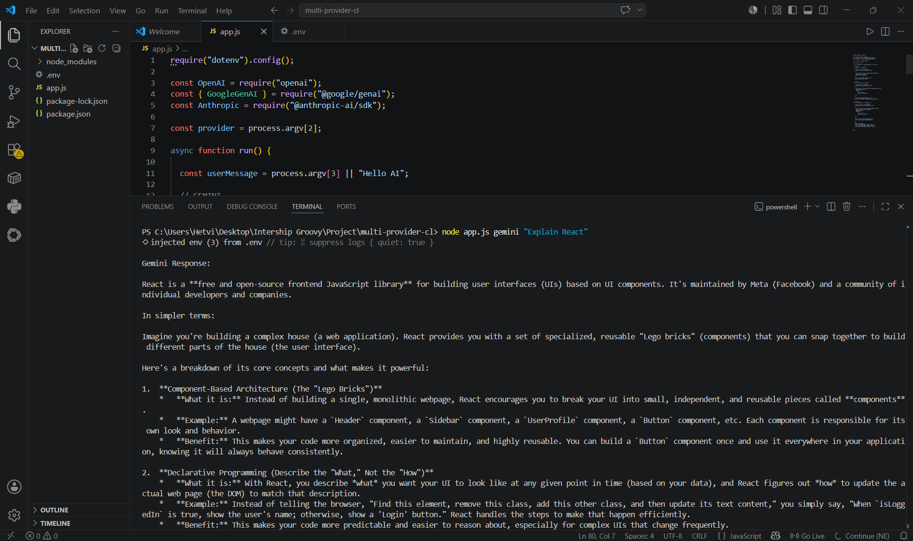
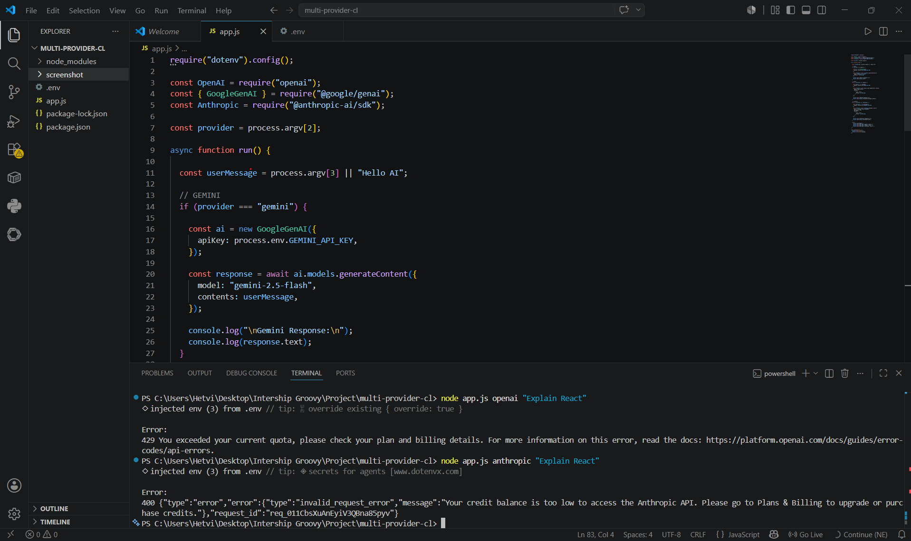

# Multi-Provider CLI Chatbot

A simple CLI chatbot that supports multiple AI providers:

* Gemini
* OpenAI
* Anthropic

Built using Node.js and environment variables.

---

# Features

✅ Multi-provider support using provider flag
✅ Gemini API integration
✅ OpenAI API integration
✅ Anthropic API integration
✅ Environment variable support using `.env`
✅ Command-line interaction

---

# Tech Stack

* Node.js
* dotenv
* OpenAI SDK
* Anthropic SDK
* Google GenAI SDK

---

# Project Structure

```bash
multi-provider-cli/
│
├── app.js
├── package.json
├── .env
└── README.md
```

---

# Installation

## 1. Clone Project

```bash
git clone <your-repo-link>
cd multi-provider-cli
```

---

## 2. Install Dependencies

```bash
npm install dotenv openai @google/genai @anthropic-ai/sdk
```

---

# Environment Variables

Create a `.env` file:

```env
OPENAI_API_KEY=your_openai_key
ANTHROPIC_API_KEY=your_anthropic_key
GEMINI_API_KEY=your_gemini_key
```

---

# Run the Project

## Gemini

```bash
node app.js gemini "Explain React"
```

---

## OpenAI

```bash
node app.js openai "Explain React"
```

---

## Anthropic

```bash
node app.js anthropic "Explain React"
```

---

# Example Outputs

## Gemini Output




---

## OpenAI + Anthropic Output



---

# Model Comparison Experiment

We tested prompts across multiple providers:

* Gemini Flash
* GPT-4o-mini
* Claude Haiku

---

## Sample Prompts Used

1. Explain React
2. Write Python Fibonacci code
3. Summarize AI in simple words
4. Generate SQL query
5. Explain REST API
6. Create HTML landing page
7. Debug JavaScript error
8. Explain OOP
9. Write email professionally
10. Compare MongoDB vs MySQL

(Repeated across providers for evaluation)

---

# Evaluation Criteria

* Speed
* Cost efficiency
* Reasoning quality
* Coding quality
* Response clarity
* Long context handling

---

# Cost Comparison Table

| Model        | Speed     | Cost     | Strength                    | Weakness                  | Best Use              |
| ------------ | --------- | -------- | --------------------------- | ------------------------- | --------------------- |
| Gemini Flash | Very Fast | Very Low | Cheap and fast              | Slightly weaker reasoning | Bulk prompts          |
| GPT-4o-mini  | Medium    | Medium   | Strong coding and reasoning | Higher cost               | Coding + reasoning    |
| Claude Haiku | Fast      | Low      | Natural writing             | Less coding power         | Summaries and writing |

---

# Approximate Cost Analysis

| Model        | Estimated Cost for 50 Prompts |
| ------------ | ----------------------------- |
| Gemini Flash | Lowest                        |
| Claude Haiku | Low                           |
| GPT-4o-mini  | Highest                       |

---

# Decision Matrix

| Use Case             | Recommended Model |
| -------------------- | ----------------- |
| Cheap bulk requests  | Gemini Flash      |
| Strong reasoning     | GPT-4o-mini       |
| Coding assistance    | GPT-4o-mini       |
| Fast responses       | Gemini Flash      |
| Professional writing | Claude Haiku      |
| Long context tasks   | Claude            |
| Budget-friendly apps | Gemini Flash      |


---


# Notes

* Gemini API worked successfully.
* OpenAI API returned quota exceeded error because free credits were unavailable.
* Anthropic API returned low credit balance error.
* These errors confirm that API integration was correctly implemented.


